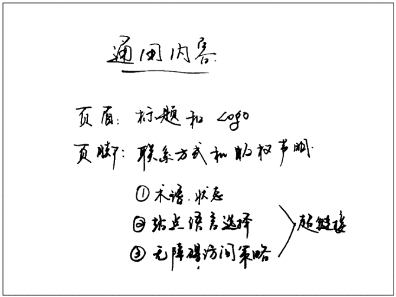

# Document and Website Structure
## 1. 文档的基本组成部分
+ **页眉(header)**  
通常横跨于整个页面顶部有一个大标题、一个标志。 这是网站的主要一般信息，通常存在于所有网页。
+ **导航栏(navigation bar)**  
指向网站各个主要区段的超链接。通常用菜单按钮、链接或标签页表示。类似于标题栏，导航栏通常应在所有网页之间保持一致，否则会让用户感到疑惑，甚至无所适从。
+ **主内容(main content)**  
中心的大部分区域是当前网页大多数的独有内容，例如视频、文章、地图、新闻等。这些内容是网站的一部分，且会因页面而异。
+ **侧边栏(sidebar)**  
一些外围信息、链接、引用、广告等。通常与主内容相关（例如一个新闻页面上，侧边栏可能包含作者信息或相关文章链接），还可能存在其他的重复元素，如辅助导航系统。
+ **页脚(footer)**  
横跨页面底部的狭长区域。和标题一样，页脚是放置公共信息（比如版权声明或联系方式）的，一般使用较小字体，且通常为次要内容。 还可以通过提供快速访问链接来进行 SEO。

## 2. 用于构建内容的 HTML
&emsp;&emsp;我们要敬畏语义，做到**正确选用元素**。这是因为视觉效果并不是一切。 我们可以修改最重要内容（例如导航菜单和相关链接）的颜色、字体大小来吸引用户的注意，但是这对视障人士是无效的，“粉红色”和“大字体”对他们并不奏效。

&emsp;&emsp;HTML 代码中可根据功能来为区段添加标记。可使用元素来无歧义地表示上文所讲的内容区段，屏幕阅读器等辅助技术可以识别这些元素，并帮助执行“找到主导航”或“找到主内容”等任务。为了实现语义化标记，HTML 提供了明确这些区段的专用标签，例如：
- `<header>`：页眉。  
- `<nav>`：导航栏。  
- `<main>`：主内容。主内容中还可以有各种子内容区段，可用 `<article>`、`<section>` 和 `
` 等元素表示。  
- `<aside>`：侧边栏，经常嵌套在 `<main>` 中。  
- `<footer>`：页脚。

## 3. HTML 布局元素细节
理解所有 HTML 区段元素具体含义是很有益处的，这一点将随着个人 web 开发经验的逐渐丰富日趋显现。更多细节请查阅 <a href="https://developer.mozilla.org/zh-CN/docs/Web/HTML/Element">HTML 元素参考</a>。现在，你只需要理解以下主要元素的意义：
- `<main>` 存放每个页面独有的内容。每个页面上只能用一次 `<main>`，且直接位于 `<body>` 中。最好不要把它嵌套进其它元素。
- `<article>` 包围的内容即一篇文章，与页面其它部分无关（比如一篇博文）。
- `<section>` 与 `<article>` 类似，但 `<section>` 更适用于组织页面使其按功能（比如迷你地图、一组文章标题和摘要）分块。一般的最佳用法是：以 标题 作为开头；也可以把一篇 `<article>` 分成若干部分并分别置于不同的 `<section>` 中，也可以把一个区段 `<section>` 分成若干部分并分别置于不同的 `<article>` 中，取决于上下文。
- `<aside>` 包含一些间接信息（术语条目、作者简介、相关链接，等等）。
- `<header>` 是简介形式的内容。如果它是 `<body>` 的子元素，那么就是网站的全局页眉。如果它是 `<article>` 或 `<section>` 的子元素，那么它是这些部分特有的页眉（此 `<header>` 非彼 标题）。
- `<nav>` 包含页面主导航功能。其中不应包含二级链接等内容。
- `<footer>` 包含了页面的页脚部分。
### 无语义元素
&emsp;&emsp;有时你会发现，对于一些要组织的项目或要包装的内容，现有的语义元素均不能很好对应。有时候你可能只想将一组元素作为一个单独的实体来修饰，来响应单一的 CSS 或 JavaScript。为了应对这种情况，HTML提供了 `
` 和 `` 元素。应配合使用 `class` 属性提供一些标签，使这些元素能易于查询。
- `
` 是一个块级无语义元素，应仅用于找不到更好的块级元素时，或者不想增加特定的意义时。
- `` 是一个内联的（inline）无语义元素，最好只用于无法找到更好的语义元素来包含内容时，或者不想增加特定的含义时。  
**警告：** `
` 非常便利但容易被滥用。由于它们没有语义值，会使 HTML 代码变得混乱。要小心使用，只有在没有更好的语义方案时才选择它，而且要尽可能少用， 否则文档的升级和维护工作会非常困难。

### 换行与水平分割线
- ` ` 元素可在段落中进行换行；<它是唯一能够生成多个短行结构（例如邮寄地址或诗歌）的元素。
- `
` 元素在文档中生成一条水平分割线，表示文本中主题的变化（例如话题或场景的改变）。一般就是一条水平的直线。

## 4. 规划一个简单的网站
&emsp;&emsp;在完成页面内容的规划后，一般应按部就班地规划整个网站的内容，要可能带给用户最好的体验，需要哪些页面、如何排列组合这些页面、如何互相链接等问题不可忽略。这些工作称为**信息架构**。
1. 时刻记住，大多数（不是全部）页面会使用一些相同的元素，例如导航菜单以及页脚内容。若网站为商业站点，不妨在所有页面的页脚都加上联系方式。请记录这些对所有页面都通用的内容：  

2. 接下来，可为页面结构绘制草图（这里与前文那个站点页面的截图类似）。记录每一块的作用：  

3. 下面，对于期望添加进站点的所有其它（通用内容以外的）内容展开头脑风暴，直接罗列出来。  

4. 下一步，试着对这些内容进行分组，这样可以让你了解哪些内容可以放在同一个页面。这种做法和 卡片分类法 非常相似。  

5. 接下来，试着绘制一个站点地图的草图，使用一个气泡代表网站的一个页面，并绘制连线来表示页面间的一般工作流。主页面一般置于中心，且链接到其他大多数页面；小型网站的大多数页面都可以从主页的导航栏中链接跳转。也可记录下内容的显示方式。  

