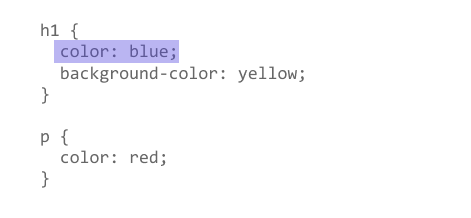

# Getting started with CSS
## 1. CSS 语法
CSS是一门基于规则的语言 —— 你能定义用于你的网页中特定元素样式的一组规则.
语法由一个 选择器(selector)起头。 它 选择(selects) 了我们将要用来添加样式的 HTML 元素。接着输入一对大括号{ }。 在大括号内部定义一个或多个形式为 属性(property):值(value); 的 声明(eclarations)。每个声明都指定了我们所选择元素的一个属性，之后跟一个我们想赋给这个属性的值。冒号之前是属性，冒号之后是值。不同的 CSS 属性(properties) 对应不同的合法值。一个 CSS 样式表可以包含很多个规则。

## 2. 样式化 HTML 元素
**元素选择器**，即直接匹配 HTML 元素的选择器。通过触发元素选择器可以选中并且样式化 HTML 元素。    
例如，若要样式化一个文档中所有的段落，只需使用选择器 `p` :
```css
p {
    color: green;
}
```
用逗号将不同选择器隔开，即可一次使用多个选择器:
```css
p, li {
    color: green;
}
```

## 3. 改变元素的默认行为
浏览器自带一个包含默认样式的样式表，默认对任何页面有效。不过你可能对浏览器的默认样式不太满意。没关系，只需选定那个元素，加一条 CSS 规则即可。  
例如，你可以移除无序列表 `<ul>` 自带的项目符号：
```css
li {
    list-style-type: none;
}
```

## 4. 使用类名
目前为止，我们通过 HTML 元素名规定样式。不过你也可以给 HTML 元素加个类名（class），再选中那个类名，就可以给特定类的元素规定样式了。  
例如，把 `class` 属性加到表里面第二个对象：
```html
<ul>
    <li>Item one</li>
    <li class="special">Item two</li>
    <li>Item <em>three</em></li>
</ul>
```
在 CSS 中，要选中这个 special 类，只需在选择器的开头加个全角句号（.）：
```css
.special {
    color: orange;
    font-weight: bold;
}
```
有时你会发现选择器中，HTML 元素选择器跟类一起出现：
```css
li.special {
    color: orange;
    font-weight: bold;
}
```
即“选中每个 special 类的 li 元素”。

## 5. 根据元素在文档中的位置确定样式
有时候，您希望某些内容根据它在文档中的位置而有所不同。这里有很多选择器可以为您提供帮助，但现在我们只介绍几个选择器。
- **后代组合器**  
单纯地在两个选择器之间加上一个空格。
```css
li em {
    color: rebeccapurple;
}
```
该选择器将选择 `<li>` 内部的任何 `<em>` 元素（ `<li>` 的后代）。

- **相邻兄弟组合器**  
在HTML文档中设置直接出现在标题后面并且与标题具有相同层级的段落样式，为此需在两个选择器之间添加一个 `+` 号。
```css
h1 + p {
    font-size: 200%;
}
```

## 6. 根据状态确定样式
根据标签的状态确定样式。一个直观的例子: 当我们修改一个链接的样式时我们需要定位 `<a>` (锚)标签。取决于是否是未访问的、访问过的、被鼠标悬停的、被键盘定位的，亦或是正在被点击当中的状态，这个标签有着不同的状态。  
下面的CSS代码使得没有被访问的链接颜色变为粉色、访问过的链接变为绿色,被鼠标悬停的时候移除下划线:
```css
a:link {
    color: pink;
}
a:visited {
    color: green;
}
a:hover {
    text-decoration: none;
}
```

## 7. 将选择器和组合器组合起来
你可以将多种选择器和组合器组合起来，也可以组合多种类。
例如：
```css
/* selects any <span> that is inside a <p>, which is inside an <article> */
article p span {...}

/* selects any <p> that comes directly after a <ul>, which comes directly after an <h1> */
h1 + ul + p {...}
```


# How CSS is structured
## 1. 在 HTML 里应用CSS
* **外部样式表**  
将CSS编写在扩展名为.css 的单独文件中，并用 HTML `<link>` 元素引用它。
* 内部样式表  
不使用外部CSS文件，而是将CSS放在 HTML `<head>` 标签里的 `<style>` 标签之中。
* 内联样式  
内联样式表存在于 HTML 元素的 `style` 属性之中。其特点是每个CSS表只影响一个元素。  
>**注意**：除非你有充足的理由，否则不要这样做！它难以维护（在需要更新时，你必须在修改同一个文档的多处地方），并且这种写法将文档结构和文档表现混合起来了，这使得代码变得难以阅读和理解。将不同类型的代码分开存放在不同的文档中，会让我们的工作更加清晰。

## 2. 选择器
为了样式化某些元素，我们会通过选择器来选中HTML文档中的这些元素。如果你的样式没有生效，那很可能是你的选择器没有像你想象的那样选中你想要的元素。  
每个CSS规则都以一个选择器或一组选择器为开始，去告诉浏览器这些规则应该应用到哪些元素上。以下都是有效的选择器或组合选择器的示例。
```css
h1
a:link
.manythings
#onething
*
.box p
.box p:first-child
h1, h2, .intro
```

### 专一性
通常情况下，两个选择器可以选择相同的HTML元素。例如：
- css-1
```css
.special {
    color: red;
}

p {
    color: blue;
}
```
- css-2
```css
p {
    color: red;
}

p {
    color: blue;
}
```
应用于如下 html 文件：
```html
<p class="special">What color am I?</p>
```
css-1应用时，段落是红色的，因为类选择器高于元素选择器；css-2应用时，段落是蓝色的，因为级联规则中，靠后的样式将覆盖之前的样式。

CSS语言有规定在发生碰撞时哪条规则将获胜--这些规则称为级联规则和专用规则。

## 3. 属性和值
在最基本的层面上，CSS由两个组成部分组成：
+ **属性**：人类可读的标识符，指出想要更改的样式特征(例如font-size, width, background-color) 
+ **值**：每个指定的属性都有一个值，该值指示如何更改这些样式特征。  

下面的图像突出显示**单个属性和值**，属性和值由冒号( : )分隔，与值配对的属性称为**CSS声明**。  
  
CSS声明放在**CSS声明块**中。
  
最后，CSS声明块与选择器配对，以生成**CSS规则集(或CSS规则)**。
  
将CSS属性设置为特定值是CSS语言的核心功能。重要的是要记住，***在CSS中属性和值都是区分大小写的***。

> **重要**：如果属性未知或某个值对给定属性无效，则声明被视为无效，并被浏览器的CSS引擎完全忽略。

> **重要**：在CSS(和其他网络标准)中，当语言表达存在不确定性时，美国的拼写被视作公认的标准。例如，颜色应该始终拼写为color。colour是不起作用的。

+ **函数**作为属性的值  
虽然大多数值是相对简单的关键字或数值，但也有一些可能的值以函数的形式出现。一个例子是calc()函数，它允许您在CSS中进行简单的计算，一个函数由函数名和一些括号组成，其中放置了该函数的允许值。例如：
```html
<div class="outer">
    <div class="inner">
        The inner box is 90% - 30px.
    </div>
</div>
```
```css
.outer {
    border: 5px solid black;
}

.inner {
    padding: 10px;
    width: calc(90% - 30px);
    background-color: rebeccapurple;
    color: white;
}
```
<div style="border: 5px solid black;">
<div style="padding: 10px; width: calc(90% - 30px); background-color: rebeccapurple; color: white;">
The inner box is 90% - 30px.
</div>
</div>

另一个例子是 `<transform>` , 例如 rotate().
```html
<div class="box"></div>
```
```css
.box {
    margin: 30px;
    height: 100px;
    width: 100px;
    background-color: rebeccapurple;
    transform: rotate(0.125turn);
}
```
<div style="margin: 30px; height: 100px; width: 100px; background-color: rebeccapurple; transform: rotate(0.125turn);"></div>

## 4. @规则
 **`@rules`** (pronounced "at-rules")是一些特殊的规则，为 CSS提供了一些关于如何表现的指导。有些 `@rules` 规则很简单，有规则名和值。例如，要将额外的样式表导入主CSS样式表，可以使用 `@import`:
```css
@import "style-2.css"
```
最常见的 `@rules` 之一是 `@media` ，它允许您使用 媒体查询 来应用CSS，仅当某些条件成立(例如，当屏幕分辨率高于某一数量，或屏幕宽度大于某一宽度时)。

在下面的 CSS中，我们将给 `<body>` 元素一个粉红色的背景色。但是，我们随后使用 `@media` 创建样式表的一个部分，该部分仅适用于视口大于30em的浏览器。如果浏览器的宽度大于30em，则背景色将为蓝色。
```css
body {
    background-color: pink;
}

@media (min-width: 30em) {
    body {
        background-color: blue;
    }
}
```

## 5. 速记属性
一些属性，如 `font`, `background`, `padding`, `border`, `margin` 等属性称为 **速记属性** —— 这是因为它们允许您在一行中设置多个属性值，从而节省时间并使代码更整洁。  
例如：
```css
/* In 4-value shorthands like padding and margin, the values are applied in the order top, right, bottom, left(clockwise from the top). There are also other shorhand types, for example 2-value shorthands, which set padding/margin for top/bottom, then left/right */
padding: 10px 15px 15px 5px;
```
等同于
```css
padding-top: 10px;
padding-right: 15px;
padding-bottom: 15px;
padding-left: 5px;
```
> **警告**：虽然速记经常允许您忽略值，但它们会将不包含的任何值重置为它们的初始值。这确保使用了一组合理的值。但是，如果您期望速记只更改传入的值，这可能会使您感到困惑。

## 6. 注释
CSS中的注释以 `/*` 开头，以 `*/` 结尾。

## 7. 空白
空白是指实际空格、制表符和新行。与HTML相同，浏览器往往忽略CSS中的大部分空白；许多空白只是为了提高可读性。  
在CSS中，属性和它们的值之间的空格需要小心。  
例如，以下声明是有效的CSS：
```css
margin: 0 auto;
padding-left: 10px;
```
以下内容无效：
```css
margin: 0auto;
padding- left: 10px;
```
“0auto”不被识别为边距属性的有效值(“0”和“auto”是两个独立的值)，而浏览器会将“padding- ”识别为有效属性。因此，您应该始终确保通过至少一个空格将不同的值分隔开来，但将属性名称和属性值作为单个未中断的字符串放在一起。
