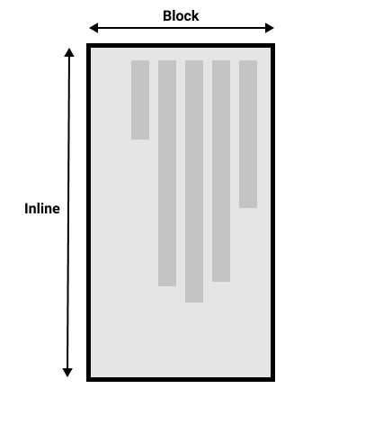

# Handling different text directions
## 1. 书写模式
CSS中的书写模式是指文本的排列方向是横向还是纵向的。`writing-mode` 属性使我们从一种模式切换到另一种模式。
`writing-mode` 的三个值分别是：
- `horizontal-tb` : 文本方向是横向的，块流向从上至下。
- `vertical-rl` : 文本方向是纵向的，块流向从右向左。
- `vertical-lr` : 文本方向是纵向的，块流向从左向右。

## 2. 书写模式、块级布局和内联布局
+ 块维度指的总是块在页面书写模式下的显示方向。而内联维度指的总是文本方向。

横向书写模式下：  
  

纵向书写模式下：  

+ 除了书写模式，我们还可以设置文本方向。

## 3. 逻辑属性和逻辑值
CSS映射属性：这些属性用 **逻辑**（logical）和 **相对变化**（flow relative）代替了 `width` 和 `height` 等类似的物理属性。

物理属性/物理值通常适用于默认的横向书写模式，但是转变为纵向书写模式后，物理属性可能无法正常工作，因此需要使用逻辑属性/逻辑值来代替。

### 3.1 逻辑宽度和高度
+ `width` ==> `inline-size`  
+ `height` ==> `block-size` 

### 3.2 逻辑外边距、边框和内边距
以 `margin` 为例：
+ `margin-top` ==> `margin-block-start`
+ `margin-bottom` ==> `margin-block-end`
+ `margin-left` ==> `margin-inline-start`
+ `margin-right` ==> `margin-inline-end`

`border` 、`padding` 同上。

### 3.3 逻辑值
一些属性的取值是物理值，同样拥有逻辑值映射。
- `top` ==> `block-start`
- `bottom` ==> `block-end`
- `left` ==> `inline-start`
- `right` ==> `inline-end`

### 3.4 应该使用物理属性还是逻辑属性呢？
逻辑属性是在物理属性之后出现的，因而最近才开始在浏览器中应用。你可以通过查看MDN的属性页面来了解浏览器对逻辑属性的支持情况。如果你并没有应用多种书写模式，那么现在你可能更倾向于使用物理属性，因为这些在你使用弹性布局和网格布局时非常有用。
